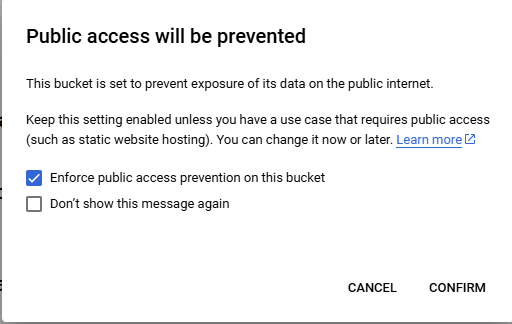
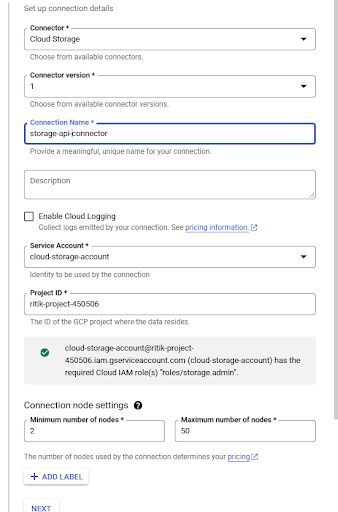
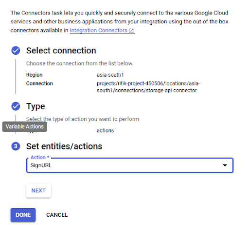
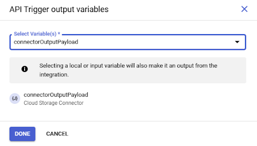
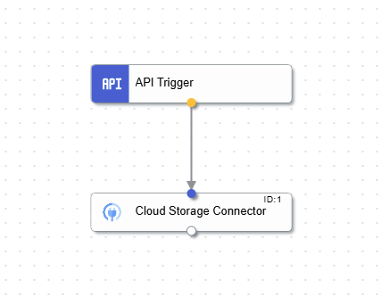
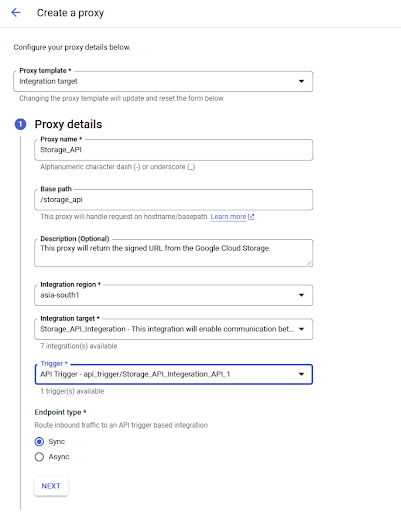

## Step 1: Create a Bucket in Google Cloud Storage (GCS)

### Navigate to Cloud Storage:
1. Open the Google Cloud Console and navigate to Cloud Storage.
2. Click on **Create Bucket**.

### Configure the Bucket:
- **Bucket Name**: Enter a unique name for your bucket (e.g., test_bucket_neosalpha).
- **Region**: Choose the region for your bucket.
- **Storage Class**: Set the storage class to **Standard** (suitable for frequent access data).

### Set Access Control:
- Choose **Fine-grained access** for more control over object access.

### Set Data Protection Policy:
- Use the default data protection policy.

### Enforce Public Access Prevention:
- A pop-up will appear when saving the configuration.
- Select **Enforce public access prevention** to ensure the data is not publicly accessible.

<div style="text-align: left; border: 5px solid black; padding: 10px;">
  
</div>

Once you complete these steps, the bucket will be created.

## Step 2: Upload the CSV File to the Bucket
1. In the **Cloud Storage console**, click on **Upload Files**.
2. Choose the CSV file (e.g., Sample-Data.csv) to upload and complete the upload.

## Step 3: Enable an API for Integration

### Step 3.1: Create Access Key for Service Account (HMAC Key)
1. Go to **IAM & Admin** in the Google Cloud Console.
2. Create an access key for the service account that will interact with GCS.
3. Generate the **HMAC Key** for secure API calls.

## Step 4: Create an Integration

### Step 4.1: Add Trigger and Connector Tasks

#### Create an Integration:
1. In Google Integration, create a new integration.

#### Add a Trigger Task:
- Add a **Trigger Task** to start the integration.

#### Add a Connector Task:
1. Add a **Connector Task** (create the Cloud Storage connector now or earlier).
   <div style="text-align: left; border: 5px solid black; padding: 10px;">
     
   </div>
2. Configure the connector by selecting the **region** and **connection settings**.

### Configure Connector:
- **Name the Connector**: (e.g., GCSConnector).
- **Select Cloud Storage** from the list of available connectors.
- **Select Service Account**: Choose the service account and grant it the Cloud IAM role `roles/storage.admin`.
- Keep the **Node Configuration** as default.
- Skip authentication and **save the configuration**.

<div style="text-align: left; border: 5px solid black; padding: 10px;">
  
</div>

- **Note**: The connector will be ready in **15-20 minutes**.

## Step 5: Configure the Connector Task
1. Go to the **Integration Console** after the connector is set up.
2. Select the newly created connector in the **Connector Task** section.
3. Set the **Task Type** to **Actions**.
4. Choose `signURL` from the list of actions to generate a signed URL.
5. Click **Next** and then **Done**.

## Step 6: Configure Input Variables for API Trigger

Define the input variables that the API trigger will use. Use the following JSON structure:

```json
{
  "Bucket": "test_bucket_neosalpha",
  "Object": "Sample-Data.csv",
  "ExpiresIn": "0d0h2m0s",
  "HmacAccessKey": "****",
  "HmacSecret": "****"
}

```


## Step 7: Configure API Trigger Output Variables
1. Click on the **API Trigger** in your integration platform.
2. Set the **API Trigger Output Variables** to use the `connectorOutputPayload` from the connector.

<div style="text-align: left; border: 5px solid black; padding: 10px;">
  
</div>

## Step 8: Connect API Trigger and Connector
- Connect the **API Trigger** and the **Connector** using the **Edge**.

<div style="text-align: left; border: 5px solid black; padding: 10px;">
  
</div>

- Publish the integration.

## Step 9: Test the Integration
After publishing the integration:
- Test the setup by viewing the logs.
- You should see the output variable with the **signed URL**.

## Step 10: Create an Apigee Proxy with Integration Endpoint

### Step 10.1: Add Authentication Policies
1. Create an **Apigee Proxy** with the **integration endpoint**.

   <div style="text-align: left; border: 5px solid black; padding: 10px;">
     
   </div>

2. Add an **Authentication Policy** in the **Pre-Flow** of the proxy to secure the endpoint.

### Step 10.2: Set Up the Integration Request
- The **SIR-Set Integration Request** will be added automatically.
- Add an **Extract Variable Policy** in the **Response Flow** to extract the **Signed URL** from the incoming payload.

### Step 10.3: Set the Response Message
- Add an **Assign Message Policy** in the **Response Flow** to include the **Signed URL** in the response along with any custom text.

## Step 11: Deploy the Proxy
1. Deploy the proxy with the **service account credentials**.
2. Once deployed, hitting the proxy endpoint will return the **signed URL**.
3. Use the **signed URL** to download the file from **Google Cloud Storage**.

## Conclusion
With these steps, you've successfully integrated **Google Cloud Storage** with **Apigee**, allowing secure access to files via signed URLs. This method provides a secure way to share files stored in **Google Cloud Storage** with controlled access.
